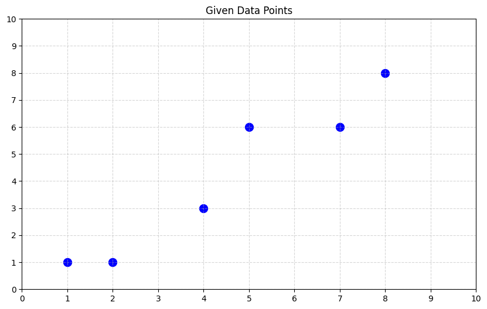
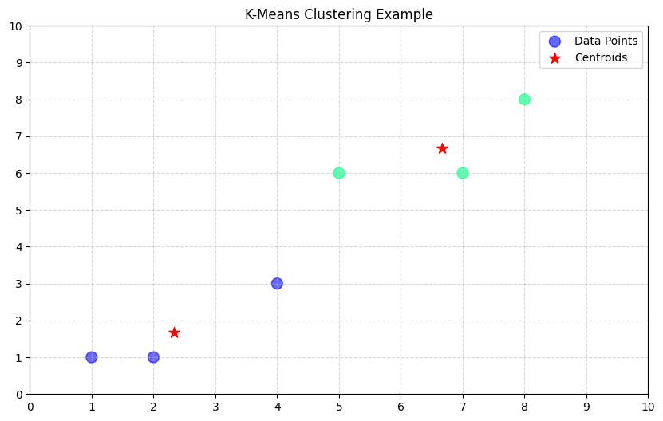

# k-means-clustering

K means is an unsupervised machine learning technique used for partitioning a dataset into k clusters, where each data point belongs to the cluster with the nearest mean (centroid).

## Given data points: 
A[1, 1], B[2, 1], C[4, 3], D[5, 6], E[7, 6], F[8, 8]

## How it work?

- 1: Initialize Centroids
     - Randomly pick 2 points as starting centroids.
     - K = 2 means we want 2 clusters.

- 2: Assign each point to the Nearest Centroid 
     - Use Euclidean distance:
          - distance = √((x₂ - x₁)² + (y₂ - y₁)²)

- 3: Recalculate New Centroids
     - For each cluster, calculate the mean X and Y.
     - These become the new centroids: [X, Y].

- 4: Reassign Points to New Centroids
     - Repeat step 2 using the updated centroids.
     - Keep repeating until the clusters stop changing, that means it's converged.

## Given Data Point

## Applied K Means Clustering

## Cluster Centroids:
[[2.33333333 1.66666667]
 [6.66666667 6.66666667]]